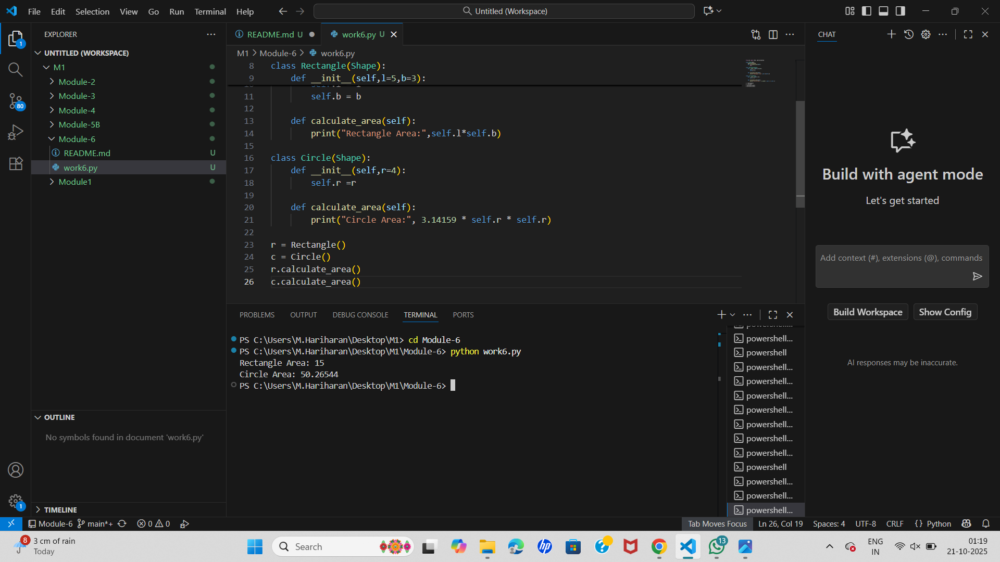
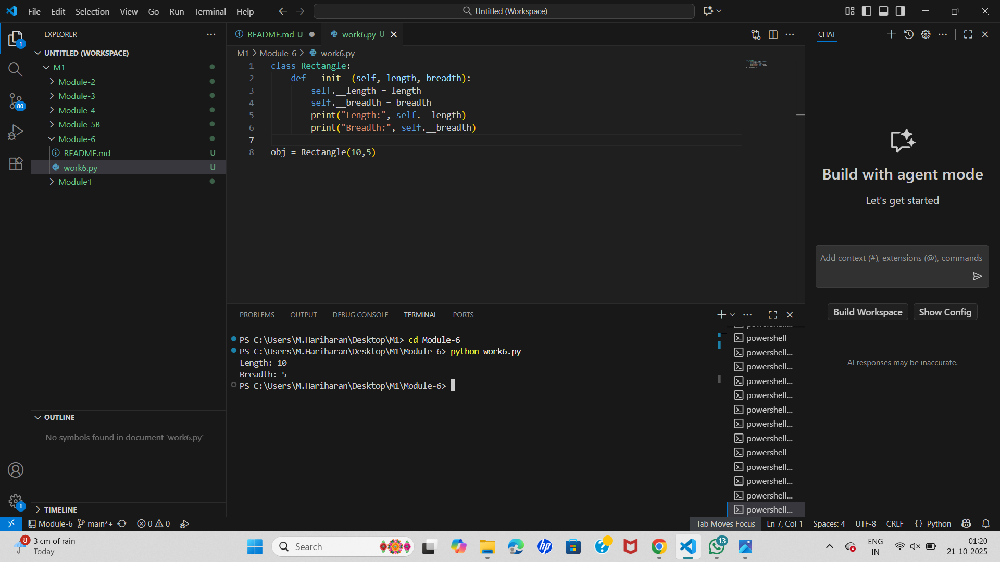
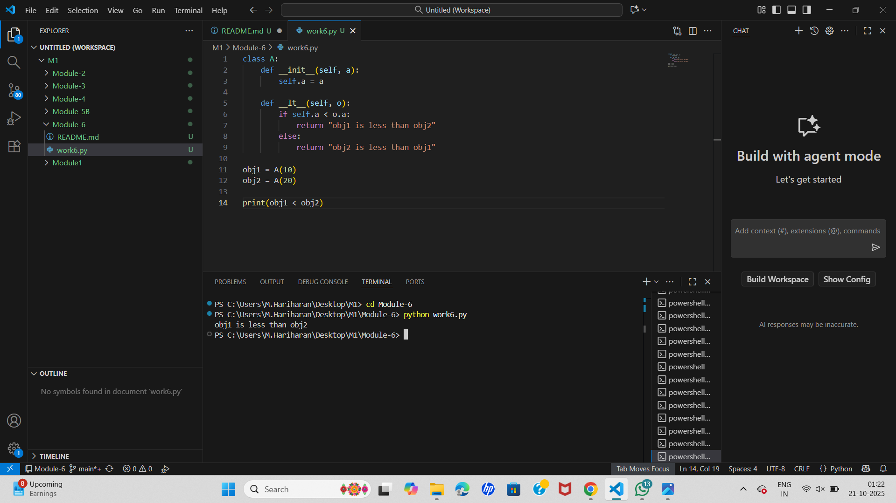

# EX-01-Python OOP: Abstract Class & Method Example

## 🎯 AIM

To create an **abstract class** named `Shape` with an **abstract method** `calculate_area`, and implement this method in two subclasses: `Rectangle` and `Circle`.

---

## 🧠 ALGORITHM

1. **Import ABC module**:
   - Use `from abc import ABC, abstractmethod` to define abstract classes and methods.

2. **Create Abstract Class `Shape`**:
   - Define an abstract method `calculate_area()` with `@abstractmethod`.

3. **Create Subclass `Rectangle`**:
   - Set default values for `length` and `breadth`.
   - Override `calculate_area()` to compute the rectangle area.

4. **Create Subclass `Circle`**:
   - Set default value for `radius`.
   - Override `calculate_area()` to compute the circle area.

5. **Create Objects & Call Methods**:
   - Instantiate `Rectangle` and `Circle`.
   - Call their `calculate_area()` methods.

---

## 💻 Program
```
from abc import ABC, abstractmethod

class Shape(ABC):
    @abstractmethod
    def calculate_area(self):
        pass

class Rectangle(Shape):
    def __init__(self, length=5, breadth=3):
        self.length = length
        self.breadth = breadth

    def calculate_area(self):
        print("Rectangle Area:", self.length * self.breadth)

class Circle(Shape):
    def __init__(self, radius=4):
        self.radius = radius

    def calculate_area(self):
        print("Circle Area:", 3.14159 * self.radius * self.radius)

r = Rectangle()
c = Circle()
r.calculate_area()
c.calculate_area()
```

## Output


## Result
```
Thus,the program has been executed sucessfully
```

# EX-02-Python OOP: Encapsulation with Private Members

## 🎯 AIM

To implement **Encapsulation** in Python by defining a class `Rectangle` with **private member variables** `__length` and `__breadth`.

---

## 🧠 ALGORITHM

1. **Define the Class**:
   - Create a class `Rectangle` with two private attributes: `__length` and `__breadth`.

2. **Initialize Variables**:
   - Use the `__init__()` constructor to set initial values for `__length` and `__breadth`.

3. **Print Values**:
   - Display the private variables from within the class to demonstrate access.

4. **Instantiate the Object**:
   - Create an object of the `Rectangle` class to trigger the constructor.

---

## 💻 Program
```
class Rectangle:
    def __init__(self, length, breadth):
        self.__length = length
        self.__breadth = breadth
        print("Length:", self.__length)
        print("Breadth:", self.__breadth)

obj = Rectangle(10, 5)
```

## Output


## Result
```
Thus,the program has been executed sucessfully
```

# EX-03-Method Overriding-Fish and Shark Class Inheritance in Python

## 🧠 AIM:
To write a Python program that demonstrates class inheritance by creating a parent class `Fish` with a method `type`, and a child class `Shark` that overrides the `type` method.

## 📋 ALGORITHM:

1. Define the `Fish` class with a method named `type()` that prints `"fish"`.
2. Define the `Shark` class as a subclass of `Fish`, and override the `type()` method to print `"shark"`.
3. Create an instance of the `Fish` class named `obj_goldfish`.
4. Create an instance of the `Shark` class named `obj_hammerhead`.
5. Use a `for` loop to iterate over both objects.
6. Within the loop, call the `type()` method using the loop variable.
7. Output will demonstrate method overriding: printing `"fish"` and `"shark"` accordingly.

## 💻 PROGRAM:
```
class Fish:
    def type(self):
        print("Fish")

class Shark(Fish):
    def type(self):
        print("Shark")

obj_goldfish = Fish()
obj_hammer = Shark()
for obj in [obj_goldfish, obj_hammer]:
    obj.type()
```

## OUTPUT


## RESULT
```
Thus,the program has been executed sucessfully
```

# EX-04-Python OOP: Operator Overloading (Less Than `<`)

## 🎯 AIM

To write a Python program that demonstrates **operator overloading** by overloading the **less than (`<`)** operator using a custom class.

---

## 🧠 ALGORITHM

1. **Create Class `A`**:
   - Define the `__init__()` method to initialize the object with a value `a`.

2. **Overload the `<` Operator**:
   - Define the `__lt__()` method with logic:
     - If `self.a < o.a`, return `"ob1 is less than ob2"`
     - Else, return `"ob2 is less than ob1"`

3. **Create Objects**:
   - Instantiate two objects `ob1` and `ob2` with values.

4. **Use `<` Operator**:
   - Use `print(ob1 < ob2)` to trigger the overloaded behavior.

---

## 💻 Program
```
class A:
    def __init__(self, a):
        self.a = a

    def __lt__(self, o):
        if self.a < o.a:
            return "obj1 is less than obj2"
        else:
            return "obj2 is less than obj1"

obj1 = A(10)
obj2 = A(20)

print(obj1 < obj2)
```


## Output


## Result
```
Thus,the program has been executed sucessfully
```

# EX-05-Python OOP: Polymorphism with Classes

## 🎯 AIM

To create two specific classes — `Beans` and `Mango`. Then, create a **generic function** that can accept any object and determine its **type** (Fruit or Vegetable) and **color**, using polymorphism.

---

## 🧠 ALGORITHM

1. **Create Class `Beans`**:
   - Define `type()` method that prints `"Vegetable"`.
   - Define `color()` method that prints `"Green"`.

2. **Create Class `Mango`**:
   - Define `type()` method that prints `"Fruit"`.
   - Define `color()` method that prints `"Yellow"`.

3. **Define Generic Function `func(obj)`**:
   - Call `obj.type()` and `obj.color()` — this works with both `Beans` and `Mango` objects, showcasing **polymorphism**.

4. **Create Objects**:
   - Instantiate `Beans` and `Mango`.
   - Pass them to `func()` and execute the program.

---

## 💻 Program
```
# Class Beans
class Beans:
    def type(self):
        print("Vegetable")
    
    def color(self):
        print("Green")

# Class Mango
class Mango:
    def type(self):
        print("Fruit")
    
    def color(self):
        print("Yellow")

# Generic function demonstrating polymorphism
def func(obj):
    obj.type()
    obj.color()

# Create objects
b = Beans()
m = Mango()

# Pass objects to the generic function
func(b)
func(m)

```  

## Output


## Result
```
Thus,the program has been executed sucessfully
```